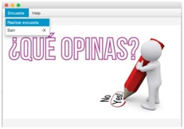
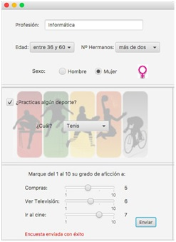

**AppEncuesta\_teamName:**

Cada equipo desarrollará una App con un escenario principal que incluya en un área central una imagen que sugiera encuestas. En el área superior, top, se incluya una barra de menú con un menú en la parte izquierda con diferentes menúitems uno por cada uno de los tipos de encuesta que se indicará  después. Otro menú en la parte derecha del top con los menuitem de ayuda y acerca de. Se supone un interfaz similar a:

 

Nota: miembro master del equipo Tiger es asir-lab 
Se crearán además varias UI (escenas gráficas) incorporando los controles necesarios para que un usuario pueda rellenar una pequeña encuesta, al final quedará una interfaz similar a la de la imagen en uno de los tipos de encuesta.  Las interfaces que se abrirán al seleccionar los menús serán cada unas pequeñas encuestas en la que se preguntará al usuario algunos datos personales, como la profesión, edad, o número de hermanos, y otros datos relacionados con los siguientes temas (un tema para cada escena):

1. Deportes, hábitos de ocio (ejemplo en la imagen adjunta)

2. Comidas, tipos de comidas, hábitos alimenticios.

3. Animales, mascotas, hábitos con las mascotas.

4. Viajes, medios de transporte, hábitos de viajar.

5. Lectura, tipo de lecturas, comics, novelas, ensayos, hábitos de lectura.

Al presionar el botón enviar se grabará la información de la encuesta en un fichero llamado Enc\_Deporte.csv, Enc\_Comidas.csv, etc., con la fecha y hora del sistema y todos los datos introducidos en una línea. Cada campo de la línea se separará por &quot;;&quot;.

Ejemplo de encuesta de Deportes:
 

El equipo Tiger empieza el desarrollo 
